<div align="center">



<br/>

<p align="center">
  <a href="https://abbakkio.dev"></a>
  <a href="https://t.me/voidpip"></a>
  <a href="mailto:upirovazat7@gmail.com"></a>
</p>

</div>

---

### `whoami`

```json
{
  "name": "Azat Madiyev",
  "status": "First-year Mathematical & Computational Science student",
  "focus": [
    "Systems Programming & macOS Internals",
    "Applied Mathematics & Algorithms",
    "Minimalist Monospace & Terminal UI/UX"
  ],
  "current_projects": [
    "Terminal Widgets (macOS MediaRemote daemon)",
    "Modular Telegram Userbot (Whisper AI)"
  ],
  "home": "https://abbakkio.dev"
}
```

---

### 🛠️ Tech Stack & Toolbox

| Category | Technologies |
| :--- | :--- |
| **Languages** | `Swift` • `Python` • `TypeScript` • `JavaScript` • `SQL` • `C/C++` |
| **UI & Frameworks** | `SwiftUI` • `AppKit` • `React` • `Vite` • `Tailwind CSS` |
| **Backend & Services** | `FastAPI` • `PostgreSQL` • `Telethon` • `Whisper AI` • `Cloudflare R2` |
| **DevOps & Workspace** | `macOS` • `Git` • `Docker` • `CLion` • `VS Code` • `Zsh` |

<br/>

<p align="center">
  
</p>

---

### 🚀 Featured Projects

#### 🖥️ **Terminal Widgets**
> **Native macOS Customization & System Daemon** • `Swift` • `SwiftUI` • `MediaRemote.framework`  
> - Desktop terminal-inspired ASCII widgets displaying live CPU, RAM, battery, and system diagnostics.
> - Custom Swift daemon interfacing directly with macOS `MediaRemote.framework` for global media playback tracking, live elapsed time calculation, and dynamic ASCII album art.

#### ⚡ [Telegram Userbot](https://github.com/abbakkio/telegram-userbot)
> **Modular Automation & On-Device AI** • `Python` • `Telethon` • `Whisper AI`  
> - Feature-rich userbot with local Whisper AI voice-note transcription.
> - Animated ghost typing, smart QR login, auto-translation, and silent macOS LaunchAgent background service.

#### 🌐 [Personal Website & Interactive Blog](https://abbakkio.dev)
> **Full-Stack Monospace Portfolio** • `React` • `TypeScript` • `Tailwind CSS` • `FastAPI` • `PostgreSQL`  
> - Sleek dark terminal interface running live at [abbakkio.dev](https://abbakkio.dev).
> - Real-time Yandex Music now-playing telemetry, threaded visitor comments, and anonymous messaging.

#### 🎙️ [Audio Transcription](https://github.com/abbakkio/transcription)
> **Modern Web Transcription Interface** • `TypeScript` • `React` • `Vite`  
> - Clean, responsive UI for audio processing and automated transcriptions.

---

### 📊 GitHub Activity

<div align="center">
  
</div>

---

<div align="center">
  <sub>Engineered with care • <a href="https://abbakkio.dev">abbakkio.dev</a></sub>
</div>
